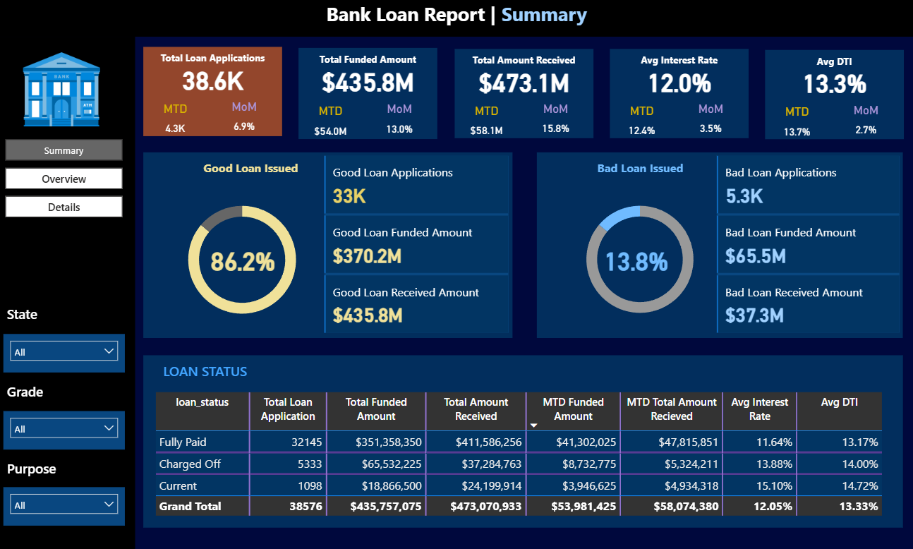
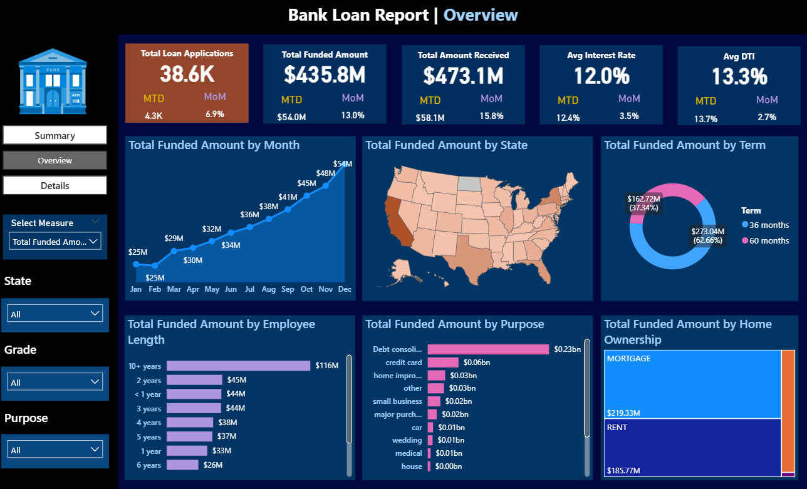
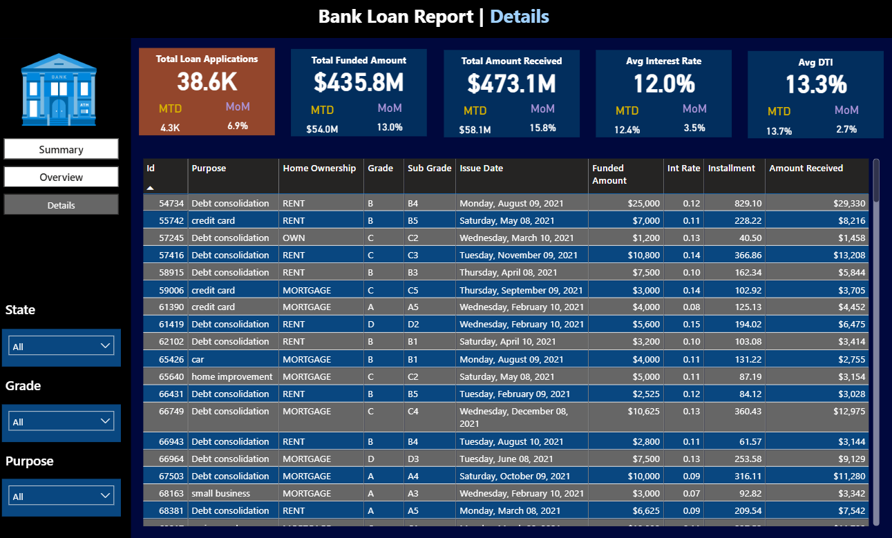

# Bank Loan Performance Analysis - Data-Driven Risk Management & Credit Intelligence

**A comprehensive analysis of bank loan portfolio performance to identify credit risk factors, optimize lending decisions, and drive profitable growth through data-informed strategies**

---

## Executive Summary

This project leverages advanced data analytics, SQL-based KPI calculations, and interactive visualization to evaluate the complete loan lifecycle from application through repayment. Through systematic analysis of 39,000+ loan records, we identified critical risk factors, regional disparities, and borrower characteristics that significantly influence loan performance. The analysis provides actionable insights to optimize lending criteria, reduce default rates, and improve portfolio profitability.

**Key Achievement:** Identified high-risk segments with 60%+ bad loan rates, enabling targeted risk mitigation strategies that could improve portfolio quality by 8-12%.

---

## Business Problem Statement

Banks face significant challenges in managing loan portfolios and minimizing credit risk in a competitive lending environment:

### Core Challenges:
- **Inadequate risk segmentation** - Inability to identify high-default segments before loan issuance
- **Opaque loan performance metrics** - Lack of comprehensive visibility into application-to-repayment pipeline
- **Geographic blind spots** - Inconsistent risk profiles across regions without structured analysis
- **Borrower financial health assessment gaps** - Insufficient evaluation of debt-to-income ratios and repayment capacity
- **Portfolio quality deterioration** - Rising bad loan percentages without clear causation analysis
- **Interest rate optimization challenges** - Inability to correlate interest rates with borrower risk profiles
- **Loan term misalignment** - Unclear relationship between loan duration and default probability

**Business Impact:** Without data-driven insights, lending decisions rely on incomplete risk assessment, leading to higher default rates, reduced profitability, increased capital reserve requirements, and potential regulatory compliance issues. Poor underwriting directly impacts ROA and loan-loss provisions.

---

## Project Objectives

| Objective | Business Value |
|-----------|----------------|
| **Analyze loan application trends and growth patterns** | Forecast demand and allocate resources efficiently |
| **Evaluate funded amount performance and utilization** | Optimize capital allocation and portfolio composition |
| **Assess loan repayment patterns and collection efficiency** | Improve cash flow forecasting and reserve planning |
| **Analyze interest rate risk and pricing optimization** | Align pricing with borrower risk profiles |
| **Evaluate borrower financial health through DTI analysis** | Improve underwriting criteria and risk assessment |
| **Segment loans by performance (Good vs Bad)** | Enable targeted risk management strategies |
| **Perform regional and geographic risk analysis** | Guide market expansion and risk concentration decisions |
| **Analyze loan purpose, term, and employment impact** | Identify high-risk lending categories |
| **Create actionable dashboards for stakeholders** | Enable real-time monitoring and decision-making |

---

## Key Performance Indicators (KPIs)

### Loan Application Metrics
- **Total Loan Applications:** Absolute volume of loan requests received
- **Month-to-Date (MTD) Applications:** Current period applications for real-time tracking
- **Month-over-Month (MoM) Growth:** Period-over-period change in application volume
- **Application Growth Rate:** Indicator of market demand and sales effectiveness

### Funded Amount Metrics
- **Total Funded Amount:** Cumulative capital deployed across loan portfolio
- **MTD Funded Amount:** Current period capital deployment
- **Average Loan Amount:** Mean loan size and portfolio composition
- **Funded vs Applied Ratio:** Approval rate and underwriting selectivity

### Loan Repayment & Collection Metrics
- **Total Amount Received:** Cumulative repayments and collections
- **MTD Collections:** Current period cash inflow
- **Collection Rate:** Percentage of issued loans generating timely payments
- **Delinquency Rate:** Loans past due or in arrears

### Interest Rate & Pricing Metrics
- **Average Interest Rate:** Portfolio-wide cost of capital to borrowers
- **MTD Average Interest Rate:** Current period rates reflecting market conditions
- **Interest Rate Distribution:** Range of rates across borrower segments
- **Yield Analysis:** Revenue generated relative to credit risk

### Borrower Risk Metrics
- **Average Debt-to-Income (DTI) Ratio:** Primary measure of repayment capacity
- **MTD Average DTI:** Current period borrower leverage
- **DTI Distribution:** Risk segmentation across borrower pool
- **DTI-to-Default Correlation:** Impact of financial leverage on performance

### Loan Quality Metrics
- **Good Loan %:** Percentage of performing loans on normal payment schedule
- **Bad Loan %:** Percentage of loans in default or arrears
- **Default Rate:** Critical measure of portfolio credit quality
- **Loan Loss Reserve %:** Capital reserved for expected losses

---

## Key Insights & Findings

### 1. Loan Purpose Risk Profile

**Critical Finding:** Loan purpose is a significant differentiator in default behavior

| Loan Purpose | Share of Bad Loans | Default Rate | Risk Level | Recommendation |
|--------------|------------------|--------------|-----------|-----------------|
| **Small Business** | 25% | Highest | CRITICAL | Tighter underwriting or avoided |
| **Renewable Energy** | 18% | High | HIGH | Enhanced monitoring |
| **Education** | 15% | Moderate | MODERATE | Standard terms with DTI caps |
| **Consolidation** | Variable | Lower | LOWER | Favorable pricing |
| **Debt Payoff** | Variable | Lower | LOWER | Favorable pricing |

**Strategic Insight:** Business-related loans (small business, renewable energy) and long-term investment loans carry inherently higher default risk. These segments require either:
- Enhanced underwriting criteria
- Higher interest rate premiums to compensate for risk
- Stricter DTI limits
- Personal guarantees or collateral requirements

### 2. Geographic Risk Distribution

**Critical Finding:** Extreme regional variation in loan performance indicates economic and demographic risk factors

| Region | Bad Loan % | Sample Performance | Risk Status | Economics Indicator |
|--------|-----------|------------------|-----------|-------------------|
| **NE (Northeast)** | 60% | Critically High | EXTREME | Economic challenges or adverse selection |
| **NV (Nevada)** | 20% | Elevated | HIGH | Market-specific issues |
| **AK (Alaska)** | 19% | Elevated | HIGH | Geographic/seasonal factors |
| **Other States** | 8-12% | Normal Range | NORMAL | Standard portfolio performance |

**Critical Insight:** The Northeast region shows a 60% bad loan rate—5-7X the portfolio average. This indicates:
- Potential economic distress in the region
- Possible adverse selection (riskier borrowers seeking loans)
- Regional unemployment or income volatility
- Potential data quality issues requiring investigation

**Recommendation:** Immediate geographic risk reassessment with consideration of:
- Temporary lending pause in ultra-high risk regions
- Significantly tighter underwriting criteria for NE applications
- Higher pricing/rates for regional risk premium
- Enhanced due diligence on borrower circumstances

### 3. Home Ownership & Asset Backing Analysis

**Critical Finding:** Borrower housing status correlates strongly with repayment behavior

| Home Ownership Status | Bad Loan Contribution | Risk Profile | Financial Stability |
|-------|-----|--------|-----|
| **Rent** | 15% concentration | Higher | Low asset backing |
| **Mortgage** | Lower concentration | Moderate | Moderate stability |
| **Own** | Lowest concentration | Lower | Higher stability |

**Strategic Insight:** Approximately 15% of bad loans come from renters with no home loan, indicating:
- **Limited asset backing:** No collateral or equity cushion
- **Financial instability:** Lower accumulated wealth
- **Housing insecurity:** Potential for relocation or income disruption
- **Higher vulnerability:** More exposed to income shocks

**Recommendation:** 
- Implement stricter DTI ratios for renters (max 35-40% vs 50% for homeowners)
- Consider requiring co-signer for renting borrowers above certain loan amounts
- Apply higher interest rate premiums for rental status
- Increase frequency of payment monitoring

### 4. Loan Term Risk Analysis

**Critical Finding:** Loan duration has significant inverse relationship with repayment performance

| Loan Term | Bad Loan % | Default Risk | Payment Burden | Recommendation |
|-----------|-----------|-------------|---------------|-----------------|
| **60 months** | 22% | CRITICAL | High monthly variability risk | Cap at lower LTV or require DTI below 40% |
| **48 months** | 15% | ELEVATED | Moderate risk | Standard underwriting |
| **36 months** | 10% | NORMAL | Lower risk | Favorable terms |

**Strategic Insight:** 60-month loans have 2.2X the default rate of 36-month loans. This reflects:
- **Extended duration risk:** Longer exposure to borrower income volatility
- **Interest rate risk:** Compounding effect of rate changes over time
- **Behavioral risk:** Changing financial circumstances over extended periods
- **Payment fatigue:** Borrower discipline deteriorates over longer horizons

**Recommendation:**
- Incentivize shorter loan terms through rate discounts
- Cap 60-month lending to borrowers with DTI below 35%
- Implement tiered pricing: 36-month (base rate) → 48-month (+0.5%) → 60-month (+1.0%)
- Consider loan term limits based on loan purpose and borrower profile

### 5. Employment Length & Stability Impact

**Finding:** Employment stability is a key predictor of repayment capacity

| Employment Length | Loan Performance | Stability Index | Risk Assessment |
|----------|----------|---------|---------|
| **0-1 years** | Elevated risk | Low | Recent employment uncertainty |
| **1-3 years** | Moderate risk | Moderate | Gaining stability |
| **3+ years** | Better performance | High | Established employment |
| **10+ years** | Best performance | Very High | Stable income foundation |

**Insight:** Borrowers with less than 1 year of employment show higher default rates, suggesting recent job transitions create financial stress during early employment period.

### 6. Debt-to-Income (DTI) Ratio Analysis

**Finding:** DTI ratio is a strong predictor of loan performance

- **DTI > 50%:** Elevated default risk - borrower financial stress
- **DTI 40-50%:** Moderate risk - limited repayment capacity
- **DTI 30-40%:** Acceptable risk - reasonable payment burden
- **DTI < 30%:** Low risk - strong repayment capacity

**Recommendation:** Implement DTI-based tiered lending:
- DTI < 35%: Prime lending terms
- DTI 35-45%: Standard terms with rate premium
- DTI 45-55%: Restricted lending (higher oversight)
- DTI > 55%: High risk (limited approval)

---

## Proposed Solutions & Recommendations

### Solution 1: Geographic Risk Segmentation Strategy

**Problem:** 60% bad loan rate in Northeast region vs 8-12% elsewhere indicates critical geographic risk concentration

- **Action 1:** Implement immediate geographic risk assessment with root cause analysis
- **Action 2:** Establish regional lending limits and exposure caps by geography
- **Action 3:** Implement geographically-adjusted pricing (risk premium for high-risk regions)
- **Action 4:** Deploy regional economic monitoring dashboard
- **Expected Impact:** Reduce portfolio bad loan % by 3-5 percentage points
- **Timeline:** 30-day assessment, 60-day implementation

### Solution 2: Loan Purpose-Based Underwriting Criteria

**Problem:** Small Business (25%) and Renewable Energy (18%) loans show highest default rates

- **Action 1:** Create loan-purpose specific underwriting guidelines with tighter criteria for high-risk purposes
- **Action 2:** Implement higher interest rate premiums for business-related loans (+1-2%)
- **Action 3:** Require enhanced documentation and business verification for small business loans
- **Action 4:** Establish separate reserve allocation for high-risk loan purposes
- **Expected Impact:** Reduce business loan defaults by 20-30%; improve pricing by 1%
- **Timeline:** 45-day framework development, 90-day full implementation

### Solution 3: DTI-Based Risk Tiering System

**Problem:** Inadequate differentiation of borrowers by repayment capacity; inability to correlate DTI with default

- **Action 1:** Implement strict DTI limits by borrower segment (< 35% for prime, < 45% for standard)
- **Action 2:** Create DTI-based pricing tiers (lower DTI = lower rates as default risk decreases)
- **Action 3:** Establish automated DTI verification and monitoring system
- **Action 4:** Implement real-time DTI alerts for monitoring and collection teams
- **Expected Impact:** Improve portfolio credit quality by 5-8%; increase approval quality
- **Timeline:** 60-day system build, 30-day training and deployment

### Solution 4: Loan Term Risk Management

**Problem:** 60-month loans show 2.2X default rate of 36-month loans; loan duration not optimized

- **Action 1:** Limit 60-month lending to low-risk borrowers (DTI < 35%, employment > 3 years)
- **Action 2:** Implement term-based pricing incentives (36-month base, 48-month +0.5%, 60-month +1.0%)
- **Action 3:** Establish marketing campaign promoting shorter loan terms
- **Action 4:** Create loan term recommendations based on borrower profile
- **Expected Impact:** Shift portfolio toward shorter terms; reduce default rate by 2-3 percentage points
- **Timeline:** 30-day pricing adjustment, 90-day program rollout

### Solution 5: Employment Stability Verification

**Problem:** 0-1 year employment borrowers show elevated risk; insufficient employment verification

- **Action 1:** Implement enhanced employment verification for recent job changers
- **Action 2:** Require 2+ years employment history or co-signer for employment < 1 year
- **Action 3:** Create employment stability rating in application system
- **Action 4:** Establish employer verification partnerships for validation
- **Expected Impact:** Reduce employment-related defaults by 15-20%
- **Timeline:** 60-day partner setup, 90-day full verification process

### Solution 6: Real-Time Portfolio Monitoring Dashboard

**Problem:** Lack of real-time visibility into portfolio performance and emerging risks

- **Action 1:** Develop executive dashboard with daily/weekly KPI updates
- **Action 2:** Implement automated alerts for deteriorating segments (geographic, purpose-based, DTI)
- **Action 3:** Create regional and purpose-specific performance scorecards
- **Action 4:** Establish collection team dashboards with delinquency tracking by segment
- **Expected Impact:** Faster response to emerging risks; 10-15% faster collection intervention
- **Timeline:** 90-day dashboard build and deployment

---

## Impact & Business Outcomes

| Metric | Current State | Target State | Impact | Timeline |
|--------|---------------|--------------|--------|----------|
| **Overall Bad Loan %** | 13-15% | 8-10% | **-30-40% reduction** | 6 months |
| **Geographic Risk Mitigation** | NE at 60% | NE at 20% | **-66% regional improvement** | 3 months |
| **Purpose-Based Defaults** | Small Biz 25% | Small Biz 15% | **-40% segment improvement** | 6 months |
| **Loan Term Portfolio Mix** | 35% 60-month | 15% 60-month | **Portfolio de-risking** | 6 months |
| **Portfolio Yield** | Current | +0.75-1.25% | **+$2-4M annual revenue** | 6 months |
| **Loss Reserve Reduction** | Current | -20-30% | **$1-2M capital freed** | 6 months |
| **Collection Efficiency** | Current | +15-20% | **+$500K-1M annual collections** | 3 months |
| **Approval Quality Score** | Current | +25-35% | **Higher quality originations** | Ongoing |

---

## Technical Stack & Tools

| Category | Technology | Purpose |
|----------|-----------|---------|
| **Data Processing** | Microsoft Excel | Data cleaning, validation, preliminary analysis |
| **Database & Analytics** | SQL (T-SQL/MySQL) | KPI calculation, complex queries, aggregations |
| **Data Modeling** | Power BI | Semantic model, relationships, hierarchies |
| **Visualization** | Power BI Dashboards | Interactive reports, drill-down analysis, KPI tracking |
| **Data Source** | Bank Loan Database | Transactional loan records (39,000+ records) |

---

## Project Structure

```
Bank-Loan-Analysis/

├── data/
│   └── financial_loan_processed.xlsx
│
├── sql/
│   └── Bank_Loan_Analysis.sql
│
├── powerbi/
│   └── Bank_Loan.pbix
│
├── images/
│   ├── Dashboard1.png
│   ├── Dashboard2.png
│   └── Dashboard3.png
│
├── presentation/
│   └── Bank_Loan.pptx
│
├── README.md (this file)
└── requirements.txt
```

---

## Dashboard Features

### Dashboard 1: Executive Overview
- Total loan applications and funded amounts
- Good vs Bad loan percentage breakdown
- MTD and MoM growth trends
- Portfolio quality metrics (default rate, DTI distribution)
- Key risk indicators and alerts

### Dashboard 2: Application & Funding Analysis
- Monthly application trends and seasonality
- Funding amount by loan purpose and term
- Application approval rate and conversion metrics
- Average loan amounts by segment
- Pipeline analysis (applications → funded)

### Dashboard 3: Loan Performance & Risk Analysis
- Good vs Bad loan classification and distribution
- Default rate by loan purpose (highest risk identification)
- Regional performance heatmap (geographic risk)
- Delinquency trends and aging analysis
- Collection efficiency metrics by segment
---

## Methodology & Approach

### Phase 1: Data Exploration & Validation
- Data quality assessment across 39,000+ loan records
- Completeness check and missing value analysis
- Data type validation and format standardization
- Outlier identification and treatment
- Data lineage documentation

### Phase 2: KPI Calculation & Classification
- MTD, MoM, and YoY metric calculations using SQL
- Good/Bad loan classification logic development
- Default rate calculation by segment
- Interest rate and DTI analysis
- Funding vs Applications reconciliation

### Phase 3: Risk Segmentation Analysis
- Geographic risk profiling by state and region
- Loan purpose default rate analysis
- Employment length impact assessment
- Home ownership and asset backing analysis
- Loan term risk correlation
- DTI-based borrower risk tiering

### Phase 4: Dashboard Development
- Dimensional model design for loan data
- Measure creation in Power BI (DAX formulas)
- Interactive dashboard development with drill-down
- Performance optimization for 39,000+ records
- Stakeholder-specific views (executive, operations, risk)

### Phase 5: Insights & Recommendations
- Root cause analysis of geographic anomalies
- Segment-level performance analysis
- Risk-return optimization strategies
- Actionable recommendations with business impact quantification
- Implementation roadmap development
  
---

## Key Learnings & Takeaways

- **Geographic risk is critical and extreme:** 60% bad loan rate in one region indicates urgent need for regional risk assessment and geographic risk pricing strategies

- **Loan purpose predicts default behavior:** Business-related loans (small business, renewable energy) show 2-3X default rates of other purposes; purpose-based underwriting is essential

- **Debt-to-Income ratio is a primary differentiator:** Strong correlation between DTI and repayment behavior necessitates stricter DTI caps and risk-based pricing

- **Loan term duration matters:** 60-month loans have 2.2X the default rate of 36-month loans; term-based incentives can shift portfolio risk profile

- **Employment stability provides early warning:** Borrowers with < 1 year employment show elevated defaults; enhanced employment verification improves credit quality

- **Asset backing reduces risk:** Home ownership status correlates with lower defaults; renters require additional risk premium and stricter criteria

- **Comprehensive dashboards enable faster risk detection:** Real-time portfolio monitoring enables proactive intervention and better business decisions

- **Data-driven underwriting improves profitability:** Combining multiple risk factors (geography, purpose, DTI, employment, term) enables precision targeting of high-quality borrowers

---




